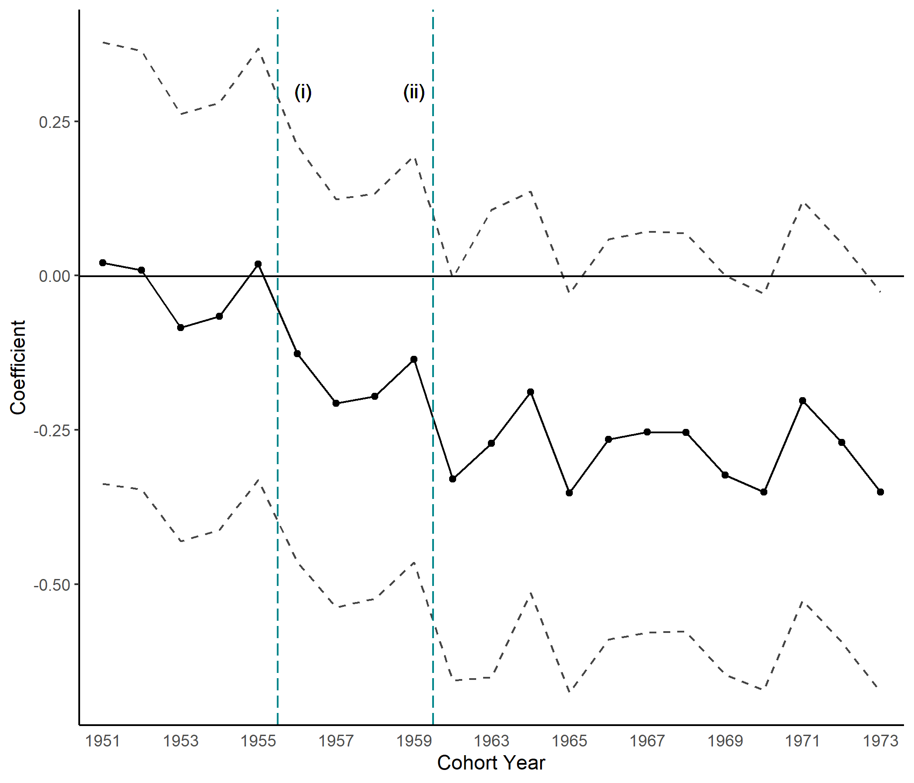

```{r setup, include=FALSE}
knitr::opts_chunk$set(echo = TRUE)
```

```{r message=FALSE, warning=FALSE, include=FALSE, paged.print=FALSE}

library(dplyr)
library(lfe)
library(gtools)
library(broom)
library(pscl)
library(tidyr)
library(leaflet)
library(png)
setwd("C:/Users/amnaj/Documents/GitHub/Blogs")

  
```

<br>

## Early Marriage and Social Norms: Evidence from India's Unenforced Child Marriage Ban?

<br><br>

<center>{width=46%}</center>

<br><br>

In October 1978, the Indian government passed the Child Marriage Restraint (Amendment) Act (CMRA) , raising the legal age of marriage for women from 15 to 18. The CMRA amendment was a national policy, ruling out the use of geographical or time variation to identify the effect of the ban. Instead, I use a quasi-experimental approach where my identification strategy relies on the fact that an individual's exposure to the policy was a function of her exogenous age when the policy was enacted and the strength of early marriage norms in her marriage market. Thus, I define treated cohorts as individuals younger than 15 (these women must now wait three extra years to legally marry) and control cohorts as individuals older than 18 in 1978 (these women could legally marry before and after the ban). I exploit the intensity of early marriage norms in the individual's marriage market, wherein norms are defined as the pre-policy probability of marrying before 18. In this figure, marriage markets are defined at the state level. 

<br>

The figure plots the interaction coefficients of a cohort dummy (or year of birth) and the marriage market pre-policy probability of early marriage. The dashed line (i) indicates the announcement of the child marriage ban by the Ministry of Health, while the dashed line (ii) indicates the passage of the policy. The three year gap between 1960 and 1963 on the x-axis indicates the dropped cohorts aged between 15-18 at policy passage. 95% confidence intervals are displayed.

<br>

The figure serves two purposes. First, it offers evidence that the identification assumption holds. That is, prior to policy announcement, there is little evidence for a differential effect of early marriage norms across marriage markets. Second, the figure summarizes the results of the paper-after policy annoucement, treated women were less likely to marry underage. 

<br><br>


