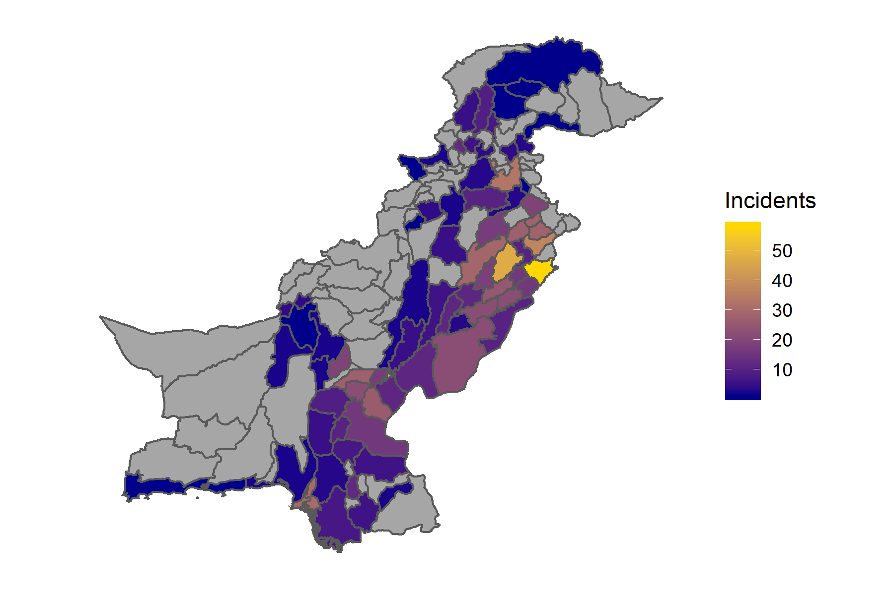

```{r setup, include=FALSE}
knitr::opts_chunk$set(echo = TRUE)
```

```{r message=FALSE, warning=FALSE, include=FALSE, paged.print=FALSE}

library(dplyr)
library(lfe)
library(gtools)
library(broom)
library(pscl)
library(tidyr)
library(leaflet)
library(png)
setwd("C:/Users/amnaj/Documents/GitHub/Blogs")

  
```

<br>

## In the Name of Honor? Evaluating the Impact of Weather Variability on Honor Killings in Pakistan

<br><br>

<center>{width=55%}</center>

<br><br>

The figure maps reported honor killing incidents in Pakistan, by district. Data was collected for the months April 2014 to August 2017, and was accessed from 11 English and Urdu newspapers. The districts with a positive number of reported killings represent approximately 91 percent of the country's population. There are no reported incidents in my data for districts shaded in gray, possibly because of a lack of reporting or low population levels. 

<br><br>